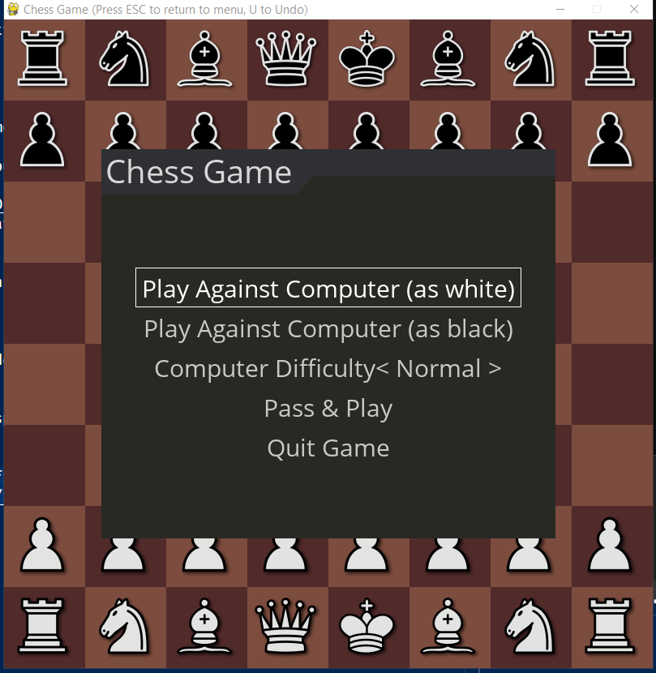
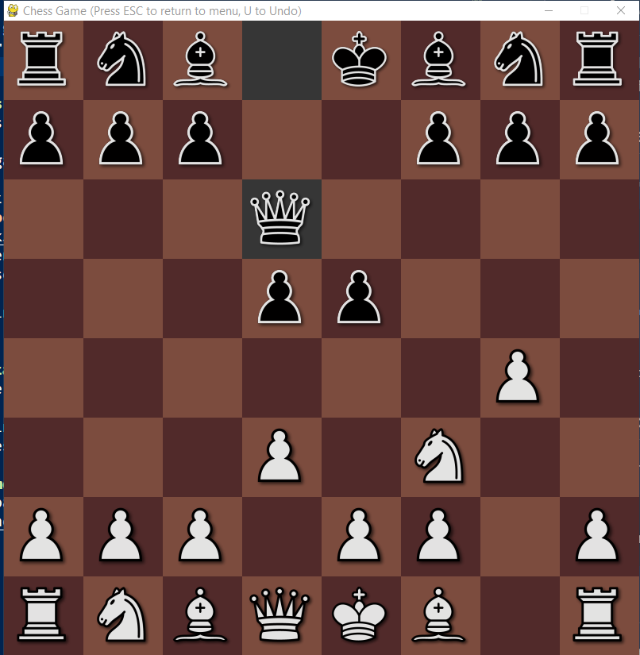

# chess_game
a simple chess game written in python (pygame). you can play against the computer or pass & play with a friend.




## Dependencies
python packages: 
```
pip install pygame pygame-menu chess
```
to play against the computer you need a chess engine. in this game a verion of **stockfish** is used ([download here](https://drive.google.com/file/d/1tPkJua6-mxYO-67isYDs6ejo5TDat7e1/view?usp=drive_link)), but any chess engine that supports the Universal Chess Interface (UCI) can be used here.

after downloading the enigne, copy the `.exe` file the `engine` folder.

## Build executable
you can package this code into a single executable using `pyinstaller`
```
pip install pyinstaller
pyinstaller chess_game.spec
```
## Play the game
your can download this from the [release page](https://github.com/AmmarHalloul/chess_game/releases/tag/game).
